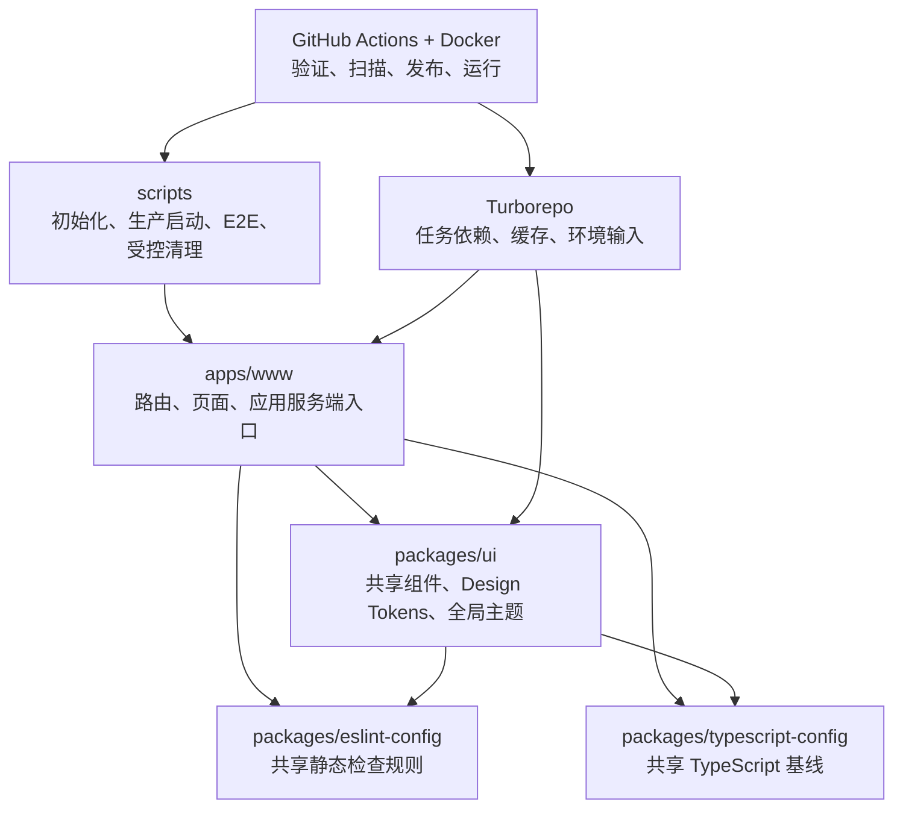
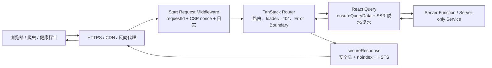
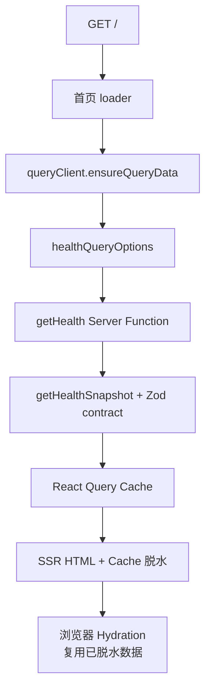
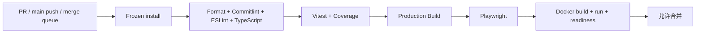
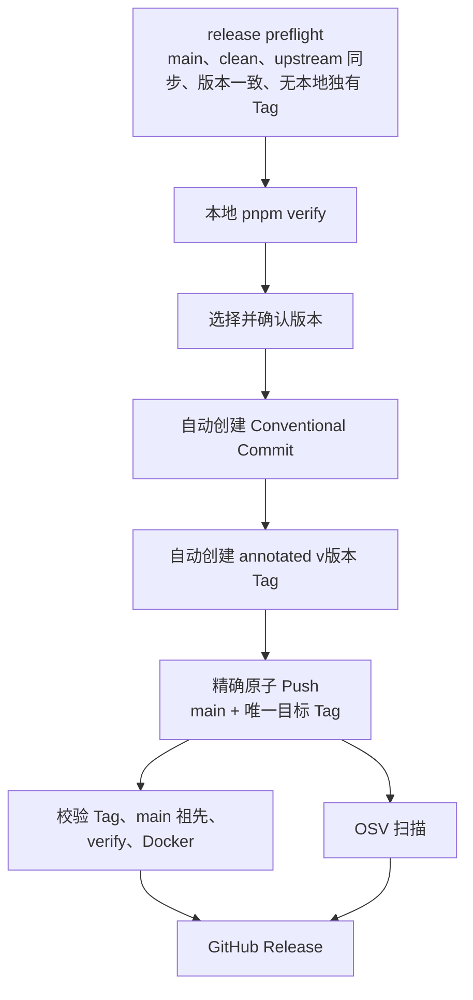

# TanStack Starter 架构改造详细说明

> 文档性质：架构审计、整改记录与后续演进基线  
> 改造提交：`14ee614`（相对父提交 `474f817`）  
> 验证快照：2026-07-10  
> 影响范围：78 个文件，约 `+2578 / -843`

## 1. 文档目的

本文记录本轮脚手架架构审计发现的问题、已实施方案、关键设计决策、验证结果、部署方式和剩余风险。
它用于回答以下问题：

- 改造前有哪些真实 BUG、工程风险和能力缺口；
- 每项问题如何落地修复，而不只是给出原则性建议；
- 当前请求、SSR 数据、环境变量、测试、CI 和发布链路如何协作；
- 使用该脚手架创建新项目时需要完成哪些初始化和部署动作；
- 后续增加业务能力时应遵守哪些架构边界。

本文是对根 [README](../README.md) 的补充。README 面向日常使用，本文面向架构评审、维护者交接和后续演进。

## 2. 改造目标与边界

### 2.1 改造目标

本轮改造围绕六个目标展开：

1. **可运行**：开发、生产、容器和 CI 使用一致且明确的运行基线。
2. **可验证**：格式、Lint、类型、单测、覆盖率、构建、E2E 和容器探针形成闭环。
3. **可发布**：版本变更和 GitHub Release 不再隐式修改 Git 状态或绕过验证。
4. **可部署**：具备严格环境变量、健康探针、安全响应头、结构化日志和非 root 镜像。
5. **可扩展**：统一路由、SSR Query、SEO、UI token 和共享包边界。
6. **可治理**：补齐依赖更新、安全扫描、贡献规范、漏洞披露和 AI 编码约定。

### 2.2 本轮未包含的业务能力

该仓库仍是通用脚手架，本轮没有假设具体业务，因此没有实现：

- 用户认证、授权、会话和 CSRF 防护；
- 数据库、缓存、队列和对象存储；
- 业务级限流、审计日志和租户隔离；
- Sentry、OpenTelemetry 等外部可观测平台；
- Analytics 用户同意管理或地区合规策略；
- npm 包发布、容器仓库推送、SBOM 和制品签名。

这些能力应在具体产品的威胁模型、数据模型和部署平台明确后再接入。

## 3. 审计问题与整改总览

优先级定义：

- **P0**：可能造成发布事故、安全边界失效或生产不可用；
- **P1**：直接影响可靠性、可维护性或持续交付；
- **P2**：影响扩展效率、体验一致性或长期治理。

| 编号 | 优先级 | 类型         | 改造前问题                                                           | 主要风险                                   | 当前状态 |
| ---- | ------ | ------------ | -------------------------------------------------------------------- | ------------------------------------------ | -------- |
| A-01 | P0     | Git          | 安装依赖时通过 `prepare` 修改仓库 `core.editor`                      | 静默改变开发者 Git 行为                    | 已修复   |
| A-02 | P0     | Release      | 任意 `v*` Tag 可直接触发发布，缺少版本和 main 祖先校验               | 错版本、错误分支被发布                     | 已修复   |
| A-03 | P0     | Runtime      | 没有统一服务端入口、安全响应头、请求 ID 和异常边界                   | 注入面扩大，错误难以追踪                   | 已修复   |
| A-04 | P0     | Env          | 公开环境变量校验不完整，拼写错误和非法 URL 可静默进入构建            | 错误 SEO、错误 Analytics、部署后才暴露问题 | 已修复   |
| A-05 | P1     | SSR          | Query 通过相对 URL 请求自身 API，首页无 loader 预取                  | SSR origin 错误、重复请求、首屏闪烁        | 已修复   |
| A-06 | P1     | Health       | 只有单一健康接口，无版本、no-store、liveness/readiness 语义          | 容器无法可靠判断进程和接流状态             | 已修复   |
| A-07 | P1     | Error        | 缺少生产错误页和安全 500 响应                                        | 信息泄露、伪 200 错误页、无法恢复          | 已修复   |
| A-08 | P1     | Docker       | 基础镜像浮动，缺少构建参数、版本、HOST 和 HEALTHCHECK                | 构建不可复现、容器无法探活                 | 已修复   |
| A-09 | P1     | CI           | 没有覆盖率、浏览器 E2E 和容器启动验证                                | “构建成功但生产不可用”无法被发现           | 已修复   |
| A-10 | P1     | Supply chain | GitHub Actions 使用可变标签，缺少最小权限、OSV 和自动依赖更新        | 上游漂移、漏洞发现滞后                     | 已修复   |
| A-11 | P1     | Tooling      | 清理脚本从当前目录递归删除任意深度同名目录                           | 越界或误删除用户文件                       | 已修复   |
| A-12 | P1     | Analytics    | 使用 `dangerouslySetInnerHTML` 拼接 GA，SPA 导航不发送独立 page view | 注入面、CSP 不兼容、数据缺失               | 已修复   |
| A-13 | P1     | Theme        | localStorage 异常可使组件崩溃，无跨标签同步和 theme-color 同步       | 水合问题、隐私模式失败、体验不一致         | 已修复   |
| A-14 | P1     | UI           | 关键颜色无自动对比度契约，Button 默认可能触发表单提交                | 无障碍退化、意外提交                       | 已修复   |
| A-15 | P2     | SEO          | canonical、Open Graph、sitemap 和品牌信息没有统一来源                | 重复内容、错误索引、复制脚手架后残留品牌   | 已修复   |
| A-16 | P2     | Monorepo     | 依赖版本、peer dependency 和 Turbo 环境缓存边界不严格                | 依赖漂移、缓存误命中                       | 已修复   |
| A-17 | P2     | Scaffold     | 缺少安全的项目初始化流程，manifest 与环境品牌配置容易分叉            | 新项目初始化不完整                         | 已修复   |
| A-18 | P2     | Governance   | 缺少贡献、安全、许可、生产运行和发布说明                             | 团队规则依赖口头传递                       | 已修复   |

## 4. 改造后的目标架构

### 4.1 Monorepo 逻辑分层



边界规则：

- 应用内部代码只通过 `@/` 访问 `apps/www/src`；
- 可复用组件、工具和 hooks 放入 `packages/ui`，通过 `@workspace/ui/*` 导入；
- 路由只放在 `apps/www/src/routes`，生成文件 `routeTree.gen.ts` 不手工编辑；
- 共享数据查询在 `src/lib/api` 内提供 `queryOptions` factory；
- 公开环境变量由 schema 统一声明，业务代码不直接散读 `import.meta.env`；
- 应用样式负责 Tailwind 扫描入口，共享样式只维护 token、base 和 utilities。

### 4.2 HTTP 请求链路



每个请求都先进入 [`src/start.ts`](../apps/www/src/start.ts)，生成请求 ID 和 CSP nonce。成功响应、框架抛出的
`Response` 以及未知 500 都经过同一安全响应出口。

### 4.3 SSR Query 链路



服务端渲染时直接执行 server-only 逻辑，不再通过相对 URL 对自身发起 HTTP 请求；客户端后续刷新则使用 POST
Server Function RPC。loader、组件、预取和失效共享同一个 query key。

## 5. 关键架构决策

| 决策   | 选择                                             | 原因                                | 代价与约束                              |
| ------ | ------------------------------------------------ | ----------------------------------- | --------------------------------------- |
| ADR-01 | 公开配置在构建期校验，服务端配置在运行期校验     | 明确客户端可见边界，尽早失败        | `VITE_*` 在容器启动后不可动态修改       |
| ADR-02 | 使用 `queryOptions` factory 作为数据访问单一入口 | loader、组件和缓存 key 保持一致     | 带参数查询必须把参数完整加入 key        |
| ADR-03 | 全局中间件统一安全响应与日志                     | 页面、API、Server Function 行为一致 | 新增第三方域名时必须同步审查 CSP        |
| ADR-04 | CSP 使用每请求 nonce                             | 支持严格脚本策略和 SSR hydration    | 必须把同一 nonce 传给 Router 与外部脚本 |
| ADR-05 | liveness 与 readiness 分离                       | 容器重启和流量接入采用不同语义      | 当前 readiness 尚未检查外部依赖         |
| ADR-06 | bumpp 自动 Commit/Tag，包装脚本精确原子 Push     | 减少漏步，避免误推 Tag 和半发布状态 | 命令仍具有显式远端副作用                |
| ADR-07 | Docker 基础镜像使用版本加 digest                 | 构建输入可复现、可审计              | 需要 Dependabot 持续更新 digest         |
| ADR-08 | Pre-commit 只检查，不自动改写暂存文件            | 避免钩子静默修改开发者提交          | 开发者需显式运行 `pnpm format`          |

## 6. 详细改造说明

### 6.1 运行时安全与可观测性

核心实现位于 [`apps/www/src/start.ts`](../apps/www/src/start.ts)。

#### 每请求上下文

- 使用 `crypto.randomUUID()` 生成 `X-Request-ID`；
- 每个请求生成独立 CSP nonce，不跨请求复用；
- nonce 通过 TanStack Start context 传入
  [`router.tsx`](../apps/www/src/router.tsx)，确保 SSR/hydration 脚本满足 CSP；
- 日志只记录 pathname，不记录 query string，减少敏感参数进入日志的概率。

#### 统一响应头

| 响应头                      | 行为                                                        |
| --------------------------- | ----------------------------------------------------------- |
| `Content-Security-Policy`   | 生产使用 nonce；只有启用 GA 时才开放 Google 域名            |
| `Permissions-Policy`        | 默认禁用 camera、geolocation、microphone                    |
| `Referrer-Policy`           | 使用 `strict-origin-when-cross-origin`                      |
| `X-Content-Type-Options`    | 设置为 `nosniff`                                            |
| `X-Frame-Options`           | 设置为 `DENY`                                               |
| `X-Request-ID`              | 所有响应均可关联请求日志                                    |
| `Strict-Transport-Security` | 仅生产且请求被识别为 HTTPS 时发送                           |
| `X-Robots-Tag`              | API、Server Function、404、500 等不可索引响应设为 `noindex` |

开发环境为 Vite HMR 有控制地允许 `unsafe-inline`、`unsafe-eval` 和 WebSocket；生产环境不包含这些放宽项。

#### 错误处理

- redirect 和 notFound 继续交给 TanStack Router，不被误转成 500；
- 主动抛出的 `Response` 保留原状态和正文，同时补齐安全头；
- 未知异常返回通用 `Internal Server Error`、请求 ID 和
  `Cache-Control: no-store`，不把堆栈暴露给客户端；
- 根路由提供生产友好的错误页、重试和返回首页；
- 真实错误信息只在开发模式页面中展示；
- 未知路由返回真实 HTTP 404，而不是状态为 200 的伪错误页。

#### 结构化日志

成功请求日志包含：

- `event=http_request`；
- HTTP method、pathname、status；
- requestId；
- durationMs。

异常日志使用 `event=http_request_error`。在 `LOG_LEVEL=info` 时跳过成功健康探针日志，避免编排平台轮询污染日志；
`debug` 模式仍可记录探针。

### 6.2 SSR、TanStack Query 与服务端契约

核心实现位于
[`apps/www/src/lib/api/health.ts`](../apps/www/src/lib/api/health.ts) 和
[`routes/index.tsx`](../apps/www/src/routes/index.tsx)。

改造内容：

- `getHealthSnapshot` 统一构造服务端健康快照；
- `parseHealthResponse` 使用 Zod 校验真实运行时数据；
- schema、解析器和快照函数包在 `createServerOnlyFn` 中；
- `getHealth` 使用 POST Server Function，避免时间戳响应被启发式缓存；
- `healthQueryOptions` 统一 query key、fetcher 和响应类型；
- Query 函数透传 AbortSignal；
- 首页 loader 在 SSR 阶段 `ensureQueryData`；
- Router 的 SSR Query integration 自动完成 cache 脱水和复水；
- Query 默认 `staleTime` 为 60 秒。

结果：

- SSR HTML 已包含 `API health: ok`；
- hydration 后不会立即重复请求；
- 不存在 `fetch('/api/health')` 的服务端内部 HTTP 自调用；
- 客户端构建产物未发现 Zod 标记，运行时 schema 没有进入业务 bundle；
- API route、Server Function 和页面 Query 共享同一健康快照契约。

### 6.3 环境变量分层

#### 构建期公开变量

[`env-schema.ts`](../apps/www/src/env-schema.ts) 在 Vite 启动和构建前执行严格校验：

- 生产构建必须提供 `VITE_SITE_URL`；
- 站点 URL 只能是 HTTP(S) origin，不能包含路径、query、fragment 或凭据；
- GA ID 必须匹配 GA4 `G-*` 格式；
- 文本字段限制长度并禁止换行；
- 外部链接只允许 HTTP(S)；
- Twitter handle 校验长度和字符集；
- 空字符串统一转换为 `undefined`；
- `.strict()` 拒绝任何未声明的 `VITE_*` 拼写错误。

[`vite.config.ts`](../apps/www/vite.config.ts) 只收集 `VITE_*`，并让进程环境覆盖对应 mode 文件。
[`env.ts`](../apps/www/src/env.ts) 仅导入 schema 类型并显式映射白名单变量，因此浏览器侧不执行 Zod。

| 变量                    | 阶段         | 生产必填 | 说明                           |
| ----------------------- | ------------ | -------- | ------------------------------ |
| `VITE_SITE_URL`         | 构建期、公开 | 是       | canonical、Open Graph、sitemap |
| `VITE_GA_ID`            | 构建期、公开 | 否       | GA4 ID；为空则不加载脚本       |
| `VITE_SITE_NAME`        | 构建期、公开 | 否       | 站点名称                       |
| `VITE_SITE_DESCRIPTION` | 构建期、公开 | 否       | 站点描述                       |
| `VITE_SITE_AUTHOR`      | 构建期、公开 | 否       | 作者或组织                     |
| `VITE_HOMEPAGE_URL`     | 构建期、公开 | 否       | 公开主页                       |
| `VITE_GITHUB_URL`       | 构建期、公开 | 否       | 公开仓库链接                   |
| `VITE_TWITTER_HANDLE`   | 构建期、公开 | 否       | X/Twitter handle               |

#### 服务端运行期变量

[`env.server.ts`](../apps/www/src/env.server.ts) 使用 server-only schema 校验并缓存：

| 变量          | 默认值        | 用途                    |
| ------------- | ------------- | ----------------------- |
| `NODE_ENV`    | `development` | CSP、日志和运行模式     |
| `APP_VERSION` | `development` | 健康接口中的部署版本    |
| `LOG_LEVEL`   | `info`        | `debug/info/warn/error` |

服务端入口初始化时读取这些变量，因此错误配置会 fail-fast。Turbo 的 build/test 缓存输入已包含 `.env*` 和显式环境变量，
避免不同环境错误复用缓存。

> 安全边界：所有 `VITE_*` 都会进入客户端构建，绝不能存放密钥、令牌、数据库地址或私有凭据。

### 6.4 健康检查与部署探针

三个端点共享 `getHealthSnapshot()`，均返回 ISO 时间、状态和部署版本，并显式设置
`Cache-Control: no-store`。

| 端点                    | 用途         | 额外字段                                  | 消费方                                   |
| ----------------------- | ------------ | ----------------------------------------- | ---------------------------------------- |
| `GET /api/health`       | 通用应用状态 | 无                                        | 页面示例、人工检查                       |
| `GET /api/health/live`  | 进程存活     | `kind=liveness`                           | Docker HEALTHCHECK、Playwright webServer |
| `GET /api/health/ready` | 接收流量     | `kind=readiness`、`checks.application=ok` | CI/Release 容器 smoke                    |

全局中间件进一步为探针补充请求 ID、安全头和 `X-Robots-Tag: noindex`。

当前 readiness 只检查应用进程。接入数据库、缓存或消息系统后，应该：

- liveness 仍只判断进程能否工作，避免外部故障触发重启风暴；
- readiness 增加关键依赖检查、超时和明确的降级状态；
- 不把密钥、内部拓扑或详细依赖错误返回给公网。

### 6.5 SEO、品牌与索引治理

新增 [`createSeo`](../apps/www/src/lib/seo.ts) 作为页面级 SEO factory：

- 统一 title、description、Open Graph、Twitter Card 和 canonical；
- canonical 必须保持在配置的站点 origin；
- 自动移除 fragment；
- 社交图片只允许 HTTP(S)；
- Twitter creator 只有配置后才输出。

根路由只保留跨页面基础 meta，首页在自身 route 中显式声明 SEO，避免未来所有页面错误继承首页 canonical。

[`config/sitemap.ts`](../apps/www/src/config/sitemap.ts) 维护可索引静态页面清单，Vite 构建时生成 sitemap。
API 和 Server Function 不进入 sitemap，并由中间件统一 noindex。

品牌配置已从模板作者信息中解耦：

- `siteConfig` 从经过校验的环境变量派生；
- Logo、Header 和 Footer 使用配置值；
- 未配置可选链接时不渲染空链接；
- 移除 Google Fonts，改用系统字体，减少第三方请求、隐私和 CSP 成本。

新增公开页面时必须同时：

1. 使用 `createSeo({ path })` 声明自身 canonical；
2. 将可索引 URL 加入 `config/sitemap.ts`；
3. 非公开页面显式 noindex；
4. 不手工编辑 `routeTree.gen.ts`。

这些约束同时写入 [`AGENTS.md`](../AGENTS.md) 和
[`new-route` skill](../.claude/skills/new-route/SKILL.md)。

### 6.6 主题、UI Token 与无障碍

#### 主题一致性

- 首屏 inline script 在 React hydration 前应用 light/dark/system，减少主题闪烁；
- Inline script 和 ThemeProvider 共享 storage key 与 theme-color 常量；
- localStorage 读写失败时回退内存状态，不使组件崩溃；
- system 模式监听操作系统主题变化；
- 监听 `storage` 事件实现多标签页同步；
- 同步 `html.class`、`data-theme`、`color-scheme` 和 meta theme-color；
- 模式按钮动态说明当前主题和下一状态；
- `prefers-reduced-motion: reduce` 时关闭平滑滚动。

#### 共享 UI 契约

[`packages/ui/src/globals.css`](../packages/ui/src/globals.css) 调整 light/dark token：

- primary、destructive、muted、ring 和 sidebar 具有可验证对比度；
- 新增 `destructive-foreground`，不再硬编码白色文本；
- 修复把 OKLCH token 包入 `hsl()` 的无效 scrollbar 颜色；
- 焦点 ring 使用清晰的语义 token。

[`Button`](../packages/ui/src/components/button.tsx) 的原生按钮默认
`type=button`，避免放进 form 后意外提交；显式 `type=submit` 仍可覆盖，`asChild` 不注入 type。

Tailwind 扫描职责移到应用入口，使用 `source(none)` 后只扫描当前应用和共享 UI，避免共享 CSS 反向扫描所有应用。
`components.json` 同步修正为非 RSC，并指向真实共享 CSS。

### 6.7 Analytics 与 CSP 协同

旧实现通过 `dangerouslySetInnerHTML` 拼接 GA 初始化代码，只记录首次加载，也无法满足严格 CSP。

新实现：

- GA ID 在构建期通过严格 schema；
- 外部脚本 URL 对 ID 做编码；
- 脚本节点使用请求级 nonce；
- 通过 React effect 初始化 `dataLayer` 和 `gtag`，不再插入危险 HTML；
- `config` 设置 `send_page_view=false`；
- 监听 TanStack Router location，首屏和 SPA 导航显式发送 page view；
- 未配置 GA 时不渲染脚本，CSP 也不信任 Google 域名。

实现与测试分别位于
[`analytics.tsx`](../apps/www/src/components/analytics.tsx) 和
[`analytics.test.tsx`](../apps/www/src/components/analytics.test.tsx)。

### 6.8 Docker 与生产启动

#### Docker

[`Dockerfile`](../Dockerfile) 采用两阶段构建：

- Builder 和 Runner 均固定 Node `22.22-alpine` 版本及多架构 digest；
- 先复制 manifests 并执行 frozen lockfile 安装，提高缓存稳定性；
- 所有公开 Vite 变量显式声明为 build args；
- 构建前强制检查 `VITE_SITE_URL`；
- 运行镜像只复制 Nitro 自包含 `.output`；
- 使用 `COPY --chown=node:node` 并以非 root `node` 用户运行；
- 设置 `HOST=0.0.0.0`、`PORT=3000`；
- 通过 `APP_VERSION` 注入部署版本；
- 使用 Node 原生 fetch 访问 liveness，避免额外安装 curl。

[`.dockerignore`](../.dockerignore) 排除真实环境文件、本地产物、覆盖率、Playwright 结果、Git 和 AI 工具本地目录。

#### 生产启动

[`scripts/start.mjs`](../scripts/start.mjs)：

- 启动前确认 `.output/server/index.mjs` 存在且可读；
- 缺少构建产物时提示先执行 `pnpm build`；
- 统一设置 `NODE_ENV=production`；
- 根目录和应用目录都提供标准 `start` 脚本。

### 6.9 测试体系

改造前只有 3 个组件测试，没有覆盖率门禁或浏览器测试。改造后：

| 范围                 | 测试数量 | 主要内容                                               |
| -------------------- | -------- | ------------------------------------------------------ |
| `apps/www` Vitest    | 17       | Env schema、SEO、健康契约、Analytics、主题、Footer     |
| `packages/ui` Vitest | 20       | light/dark 对比度、focus ring、语义 token、Button type |
| Playwright           | 3        | SSR/hydration/主题、readiness/CSP、安全 404            |

覆盖率配置：

- 应用阈值：statements 40%、branches 35%、functions 35%、lines 42%；
- UI 阈值：statements 95%、branches 60%、functions 95%、lines 95%；
- 输出 text、JSON summary、LCOV 和 HTML；
- E2E 目录从 Vitest 中显式排除。

Playwright 运行真实生产 Nitro 服务：

- 使用 `APP_VERSION=e2e`；
- 等待 `/api/health/live`；
- CI 中失败重试 2 次并保留首次重试 trace；
- 检查 SSR 页面直接包含健康数据；
- 检查 hydration 后无 page error 或 console error；
- 检查 readiness 的 no-store、noindex、request ID 和 nonce CSP；
- 检查未知路由真实返回 404。

[`scripts/e2e.mjs`](../scripts/e2e.mjs) 为本地测试提供默认站点 URL，并在 Windows 使用 `pnpm.cmd`。

### 6.10 CI、发布与供应链安全

#### CI

[`.github/workflows/ci.yml`](../.github/workflows/ci.yml) 现在支持 PR、main push 和 merge queue：

- GitHub Actions 固定到完整 commit SHA；
- 默认权限仅 `contents: read`；
- 20 分钟超时；
- 同分支新任务取消旧任务；
- 完整 Git 历史用于 Commitlint；
- Node 固定 `22.22.3`，pnpm 使用项目声明版本；
- 依赖安装使用 `--frozen-lockfile`；
- 检查格式、提交消息、Lint、类型、覆盖率、构建、Playwright 和 Docker readiness；
- Docker smoke 使用重试等待探针，并通过 trap 输出日志和回收容器。



#### Release

本地 `pnpm release` 是显式的远端发布命令。它先通过
[`release-preflight.mjs`](../scripts/release-preflight.mjs) 确认工作区干净、当前分支为 `main`、本地与 upstream
完全同步、根应用版本一致且不存在仅本地 Tag，再执行完整 verify。使用者选择并确认版本后：

1. bumpp 只更新根目录和 `apps/*/package.json`；
2. bumpp 创建符合 Commitlint 的 `chore(release): v<version>` 提交，并执行 Git hooks；
3. bumpp 创建 annotated `v<version>` Tag；
4. [`release-push.mjs`](../scripts/release-push.mjs) 再次校验 release commit、版本文件、Tag、remote 和 upstream；
5. 使用 `git push --atomic` 只推送当前 `main` 与本次目标 Tag。

Tag 发布流程：

1. Release workflow 校验 Tag 必须严格等于根版本号的 `v<version>`；
2. 校验 Tag 指向的提交已经包含在 `origin/main`；
3. 再次执行 frozen install、完整 verify 和 Docker smoke；
4. OSV 扫描必须通过；
5. 只有最终 release job 获得 `contents: write`；
6. 使用 `gh release create --generate-notes --verify-tag` 创建 GitHub Release。



如果原子 Push 失败，远端 branch 和 Tag 都不应变化；本地会保留 release commit 与 annotated Tag。修复远端权限、同步或网络
问题后只运行 `node scripts/release-push.mjs`，不要重新执行 bumpp 选择新版本。

#### 供应链

- [OSV workflow](../.github/workflows/osv.yml) 覆盖 PR、main push、每周定时和 Release；
- OSV reusable workflow 固定到 v2.3.8 对应完整 SHA；
- [Dependabot](../.github/dependabot.yml) 管理 npm、GitHub Actions 和 Docker；
- 生产/开发依赖 minor、patch 分组，降低升级噪声；
- npm registry 使用官方源；
- 关闭自动安装 peer，启用严格 peer dependency；
- Tailwind、Vitest、coverage provider 和 Playwright 的关键版本统一由 catalog 管理。

### 6.11 工程脚本与仓库治理

#### 初始化脚本

[`scripts/init.mjs`](../scripts/init.mjs) 提供 `pnpm scaffold:init`：

- 交互采集站点 URL、名称、描述、作者、公开链接、Twitter 和 GA4；
- 输入规则与构建期 schema 对齐；
- 明确提示所有 `VITE_*` 均为公开值；
- 默认拒绝覆盖已有 `.env`，只有 `--force` 可替换；
- 拒绝符号链接和特殊文件；
- 写入前再次检查竞态，新文件使用独占创建；
- 同步 PWA manifest 的名称和描述；
- 任一步骤失败时回滚 manifest 和环境文件。

#### 安全清理脚本

[`scripts/clean.mjs`](../scripts/clean.mjs) 不再递归遍历任意目录：

- 仓库根由脚本自身位置确定；
- 只处理根和 `apps/*`、`packages/*` 的直接 workspace；
- 删除对象采用固定允许列表；
- 提供 `--dry-run`；
- `pnpm-lock.yaml` 只有显式 `--del-lock` 时可删除，且只允许根文件；
- 拒绝 symlink、非 canonical path、越界路径、`.git` 和未知参数；
- 汇总成功、缺失和错误，有错误时返回非零状态。

#### Git 与格式治理

- 删除会修改 `core.editor` 的 `prepare`；
- Pre-commit 只做 Prettier check 和 Lint，不自动修改或重新暂存文件；
- Pre-push 执行类型检查；
- commit-msg 执行 Commitlint；
- 根 ESLint 检查 scripts 和配置文件；
- Prettier 覆盖所有支持文件，CommonJS 配置改名为 `.prettierrc.cjs`；
- `.gitignore`、`.dockerignore`、`.prettierignore` 对环境文件和测试产物保持一致。

#### 文档治理

新增或更新：

- [根 README](../README.md)；
- [应用 README](../apps/www/README.md)；
- [贡献指南](../CONTRIBUTING.md)；
- [安全策略](../SECURITY.md)；
- [MIT License](../LICENSE)；
- [AI 编码约定](../AGENTS.md)；
- [新路由 Skill](../.claude/skills/new-route/SKILL.md)。

## 7. 验证记录

### 7.1 完整门禁

以下命令已通过：

```bash
pnpm install --frozen-lockfile
pnpm format:check
pnpm lint
pnpm check-types
pnpm test:coverage
VITE_SITE_URL=https://example.com pnpm build
VITE_SITE_URL=https://example.com pnpm verify
git diff --check
```

`pnpm verify` 的顺序为：

```text
format:check
  → lint
  → check-types
  → test:coverage
  → build
  → test:e2e
```

### 7.2 测试与覆盖率快照

| 范围          | Statements | Branches | Functions | Lines  | 结果               |
| ------------- | ---------- | -------- | --------- | ------ | ------------------ |
| `apps/www`    | 57.48%     | 48.57%   | 54.09%    | 58.94% | 17 tests，通过阈值 |
| `packages/ui` | 100%       | 71.42%   | 100%      | 100%   | 20 tests，通过阈值 |
| Playwright    | -          | -        | -         | -      | 3/3 通过           |

### 7.3 生产 HTTP smoke

已使用生产构建直接验证：

- `/` 返回 200，SSR HTML 已包含健康状态和唯一 canonical；
- 生产 CSP 含每请求 nonce，不含 `unsafe-inline`；
- 未启用 GA 时 CSP 不包含 Google 域名；
- `/api/health`、`/live`、`/ready` 返回 200、no-store、noindex 和版本；
- `/missing` 返回真实 404、noindex，且不输出首页 canonical；
- 健康轮询不会在 info 级别持续产生成功日志；
- Workflow YAML 语法解析通过；
- 初始化、清理、启动和 E2E 脚本通过 Node 语法检查；
- 清理脚本 dry-run 通过。

### 7.4 当前验证例外

#### Docker 本机运行

本机 Docker/OrbStack daemon 未启动，因此未在本机完成镜像 build/run。镜像构建、容器启动和
`/api/health/ready` 重试检查已经写入 CI 与 Release，仍需以首次真实 CI 运行结果作为容器层最终证据。

#### 当前提交消息

改造提交标题为：

```text
Refine app routing and shared UI foundations
```

它不符合本轮刚启用的 Conventional Commits，单独执行以下检查会得到 `type-empty` 和 `subject-empty`：

```bash
pnpm exec commitlint --from HEAD^ --to HEAD --verbose
```

这不影响代码、测试和构建结果，但该提交对应的 CI Commitlint 步骤会失败。后续提交必须使用类似：

```text
refactor: harden starter architecture and tooling
```

若提交历史允许改写，可由提交拥有者修正标题；若已经共享或推送，不应为此擅自 force-push，后续从新的 Conventional
Commit 开始保持合规即可。

## 8. 使用与迁移指南

### 8.1 新项目初始化

```bash
corepack enable
pnpm install
pnpm scaffold:init
pnpm dev
```

初始化完成后还需要：

1. 替换 favicon、PWA 图标和品牌图片；
2. 检查 `public/manifest.json`；
3. 确认 `VITE_SITE_URL` 是最终生产 origin；
4. 根据隐私要求决定是否配置 GA；
5. 运行 `pnpm verify`；
6. 首次 E2E 前安装 Chromium：

```bash
pnpm --filter www exec playwright install chromium
```

### 8.2 本地生产验证

```bash
VITE_SITE_URL=https://example.com APP_VERSION=local pnpm build
APP_VERSION=local pnpm start
```

检查：

```bash
curl -i http://127.0.0.1:3000/api/health/live
curl -i http://127.0.0.1:3000/api/health/ready
```

### 8.3 Docker 构建

```bash
docker build --build-arg VITE_SITE_URL=https://example.com --build-arg APP_VERSION=local -t tanstack-starter .
docker run --rm -p 3000:3000 tanstack-starter
```

注意：

- `VITE_*` 是构建参数，不是 secret；
- 容器启动后修改 `VITE_*` 不会改变已构建客户端；
- 生产应传入可追溯的 `APP_VERSION`，例如 Git SHA；
- TLS 在代理终止时，应确保 HSTS 在可信边缘设置，或让应用正确识别原始 HTTPS。

### 8.4 现有项目迁移检查

从旧脚手架迁移时至少确认：

- Node 升级到 `>=22.12.0`，使用 pnpm `10.27.0`；
- 重新执行 frozen install；
- 新增的公开变量同步到部署构建配置；
- 不把 server secret 改名成 `VITE_*`；
- CI 安装 Playwright Chromium；
- 反向代理允许并保留必要安全响应头；
- 运行环境注入 `APP_VERSION`；
- 编排平台分别使用 live 和 ready；
- 新页面补 canonical 和 sitemap；
- 新增外部资源前评估 CSP；
- 仓库分支保护将完整 CI 设为必需检查。

## 9. 扩展开发规范

### 9.1 新增数据查询

1. 在 `apps/www/src/lib/api/<name>.ts` 声明响应类型；
2. 服务端逻辑放在 server-only 边界；
3. 导出稳定的 `queryOptions` factory；
4. 参数必须进入 query key；
5. 页面 loader 和组件复用同一 factory；
6. 明确 staleTime、错误降级、取消和重试策略；
7. 为运行时契约和关键用户路径补测试。

### 9.2 新增页面

1. 使用文件路由和 `createFileRoute`；
2. 使用 `createSeo` 声明页面 title、description 和 canonical；
3. 可索引页面同步 `config/sitemap.ts`；
4. 私有页面明确 noindex；
5. 有首屏数据时在 loader 预取；
6. 不编辑 `routeTree.gen.ts`；
7. 至少运行应用 lint、类型和相关测试。

### 9.3 新增环境变量

公开变量需要同时更新：

1. `env-schema.ts`；
2. `env.ts` 显式映射；
3. `.env.example`；
4. `turbo.json` 对应任务 env；
5. Dockerfile build args；
6. 初始化脚本和文档（如面向使用者）。

服务端敏感变量只放入 `env.server.ts` 或具体 server-only 模块，不使用 `VITE_` 前缀。

### 9.4 新增共享 UI

- 优先使用现有语义 token；
- 不在组件内硬编码前景色；
- 原生按钮明确 type；
- 图标按钮提供 accessible name；
- 检查键盘焦点、禁用态、暗色和 reduced motion；
- 新 token 增加 light/dark 对比度契约；
- 应用专属组件不要下沉到共享包。

## 10. 剩余风险与后续路线图

### P1：建议下一个迭代处理

1. **关键运行时测试**：为 `start.ts` 的 CSP、异常 Response、redirect/notFound 和 500 增加 request-level 测试。
2. **Readiness 真实化**：接入数据库或缓存后增加超时依赖检查，保持 liveness 无外部依赖。
3. **错误监控**：将 `reportRouteError` 和服务端错误日志接入 Sentry/OpenTelemetry，并传播 request/trace ID。
4. **SEO 一致性检查**：自动验证公开路由、canonical 与 sitemap 不漂移。
5. **版本一致性**：Release 同时校验根和 `apps/www/package.json` 版本。
6. **Node 类型统一**：catalog 的 `@types/node` 与实际 Node 22 运行基线对齐。

### P2：按产品和部署需求推进

1. 增加 axe、键盘导航、移动 viewport 和视觉回归测试；
2. 根据风险增加 Firefox/WebKit；
3. 构建期生成 manifest、robots.txt 和 locale，消除品牌元数据分叉；
4. 为 Analytics 增加 SPA 多导航测试、Consent/CMP 和 Do Not Track 策略；
5. 增加 Secret Scanning、CodeQL、SBOM、provenance 和镜像签名；
6. 为生产容器配置只读根文件系统、capability drop 和平台级 seccomp；
7. 拆分 CI 为静态检查、单测、E2E、Docker 并行 job，减少总时长；
8. 评估 Turborepo 远程缓存；
9. 持续评估当前 Nitro beta 版本的稳定性和升级兼容性；
10. 补充清理脚本和初始化脚本的临时目录 fixture 测试。

## 11. 关键文件索引

| 领域                | 文件                                                                                          |
| ------------------- | --------------------------------------------------------------------------------------------- |
| 全局运行时与安全    | [`apps/www/src/start.ts`](../apps/www/src/start.ts)                                           |
| Router 与 SSR nonce | [`apps/www/src/router.tsx`](../apps/www/src/router.tsx)                                       |
| SSR Query 范式      | [`apps/www/src/lib/api/health.ts`](../apps/www/src/lib/api/health.ts)                         |
| 公开 Env schema     | [`apps/www/src/env-schema.ts`](../apps/www/src/env-schema.ts)                                 |
| 服务端 Env schema   | [`apps/www/src/env.server.ts`](../apps/www/src/env.server.ts)                                 |
| SEO factory         | [`apps/www/src/lib/seo.ts`](../apps/www/src/lib/seo.ts)                                       |
| Sitemap 清单        | [`apps/www/src/config/sitemap.ts`](../apps/www/src/config/sitemap.ts)                         |
| Theme Provider      | [`apps/www/src/components/theme-provider.tsx`](../apps/www/src/components/theme-provider.tsx) |
| Analytics           | [`apps/www/src/components/analytics.tsx`](../apps/www/src/components/analytics.tsx)           |
| UI token            | [`packages/ui/src/globals.css`](../packages/ui/src/globals.css)                               |
| UI 契约测试         | [`packages/ui/src/theme-contract.test.ts`](../packages/ui/src/theme-contract.test.ts)         |
| CI                  | [`.github/workflows/ci.yml`](../.github/workflows/ci.yml)                                     |
| Release             | [`.github/workflows/release.yml`](../.github/workflows/release.yml)                           |
| OSV / Dependabot    | [`osv.yml`](../.github/workflows/osv.yml)、[`dependabot.yml`](../.github/dependabot.yml)      |
| Docker              | [`Dockerfile`](../Dockerfile)                                                                 |
| 初始化              | [`scripts/init.mjs`](../scripts/init.mjs)                                                     |
| 生产启动            | [`scripts/start.mjs`](../scripts/start.mjs)                                                   |
| E2E 调度            | [`scripts/e2e.mjs`](../scripts/e2e.mjs)                                                       |
| Release preflight   | [`scripts/release-preflight.mjs`](../scripts/release-preflight.mjs)                           |
| Release atomic push | [`scripts/release-push.mjs`](../scripts/release-push.mjs)                                     |
| bumpp 配置          | [`bump.config.mjs`](../bump.config.mjs)                                                       |
| 安全清理            | [`scripts/clean.mjs`](../scripts/clean.mjs)                                                   |

## 12. 验收结论

本轮改造已经把项目从“可启动的技术示例”提升为“具备生产基线的应用脚手架”：

- 运行时有明确安全边界和故障响应；
- SSR 数据链路不依赖内部 HTTP，缓存契约统一；
- 环境变量在正确阶段校验并区分公开与服务端；
- 生产服务和容器具有版本、探针和非 root 基线；
- 单测、覆盖率、E2E、Docker smoke、OSV 和发布验证形成交付闭环；
- SEO、主题、UI token、初始化和扩展规范可以被新项目复用。

它仍不是包含认证、数据层、业务监控和合规策略的完整产品模板。后续扩展应优先保持本文定义的边界，
再根据具体业务补齐威胁模型、依赖探针、可观测性和制品安全。
